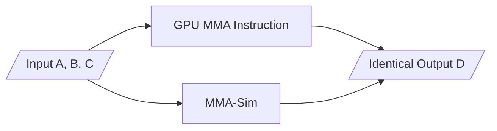

# MMA-Sim: Bit-Accurate Modeling of GPU Matrix Multiply-Accumulate Units


MMA-Sim models the non-standard arithmetic behaviors of GPU matrix multiply-accumulate units such as [Tensor Cores](https://www.nvidia.com/en-us/data-center/tensor-cores/) and [Matrix Cores](https://www.amd.com/en/technologies/cdna.html). For an architecture-specific matrix multiply-accumulate (MMA) instruction, MMA-Sim simulates the MMA operation `D=A*B+C` and produces outputs **bit-wise identical** to the outputs of the GPU MMA instruction.



[Our paper](https://arxiv.org/abs/2511.10909) details the arithmetic behavior models, explains the numerical discrepancies among GPU architectures, and analyzes their numerical accuracy. 

## How to use MMA-Sim

Installation:

```shell
pip install mmasim
```

Example:

```python
import torch
from mmasim.nv_ptx.sim import MMA  # for "mma.sync" instructions
from mmasim.amd.sim import MFMA  # for "v_mfma" instructions

# mma.sync.aligned.m16n8k16.row.col.f32.f16.f16.f32 (PTX)
# or HMMA.16816.F32 (SASS)
mma_a100 = MMA("Ampere", "m16n8k16.f32.f16.f16.f32")

# v_mfma_f32_16x16x16_f16
mfma_mi300 = MFMA("CDNA3", "f32_16x16x16_f16")

A = torch.randn([16, 16], dtype=torch.float16)
B = torch.randn([16, 16], dtype=torch.float16)
C = torch.zeros([16, 16], dtype=torch.float32)
D_a100 = torch.cat([mma_a100(A, B[:, :8], C[:, :8]), mma_a100(A, B[:, 8:], C[:, 8:])], dim=1)
D_mi300 = mfma_mi300(A, B, C)
print(D_a100 - D_mi300)  # non-zero values indicate numerical discrepancies
```

Supported GPU architectures: `Volta`, `Turing`, `Ampere`, `Ada Lovelace`, `Hopper`, `Blackwell`, `RTX Blackwell`, `CDNA1`, `CDNA2`, and `CDNA3`.

Supported MMA instructions: `mma.sync`, `wgmma.mma_async`, `tcgen05.mma`, and `v_mfma`.

Supported data types: FP64, FP32, TF32, FP16, BF16, FP8, FP4, MXFP8, MXFP4, and NVFP4.

## How to verify the equivalence between MMA-Sim and GPU

You should have a GPU and the additional installation for differential testing:

```shell
pip install mmasim-kernels
```

Example:

```python
import torch
from mmasim.nv_ptx.sim import MMA
from mmasim_kernels.nv_ptx.rtx_blackwell import mma_kernels

mma_sim = MMA("RTX Blackwell", "m16n8k16.f32.f16.f16.f32")
mma_gpu = mma_kernels["m16n8k16.f32.f16.f16.f32"]

for _ in range(1000):
    A = torch.randn([16, 16], dtype=torch.float16, device="cuda")
    B = torch.randn([16, 8], dtype=torch.float16, device="cuda")
    C = torch.zeros([16, 8], dtype=torch.float32, device="cuda")
    D_sim = mma_sim(A, B, C)  # MMA-Sim also supports GPU tensors
    D_gpu = mma_gpu(A, B, C)
    assert torch.equal(D_sim, D_gpu)  # bit-wise identical
```

Additionally, you can run test scripts in [tests/equivalence](tests/equivalence) to verify the equivalence for MMA instructions on your GPU.

## Citation

```
Coming soon
```

## Contributing

This project welcomes contributions and suggestions.  Most contributions require you to agree to a
Contributor License Agreement (CLA) declaring that you have the right to, and actually do, grant us
the rights to use your contribution. For details, visit [Contributor License Agreements](https://cla.opensource.microsoft.com).

When you submit a pull request, a CLA bot will automatically determine whether you need to provide
a CLA and decorate the PR appropriately (e.g., status check, comment). Simply follow the instructions
provided by the bot. You will only need to do this once across all repos using our CLA.

This project has adopted the [Microsoft Open Source Code of Conduct](https://opensource.microsoft.com/codeofconduct/).
For more information see the [Code of Conduct FAQ](https://opensource.microsoft.com/codeofconduct/faq/) or
contact [opencode@microsoft.com](mailto:opencode@microsoft.com) with any additional questions or comments.

## Trademarks

This project may contain trademarks or logos for projects, products, or services. Authorized use of Microsoft
trademarks or logos is subject to and must follow
[Microsoft's Trademark & Brand Guidelines](https://www.microsoft.com/legal/intellectualproperty/trademarks/usage/general).
Use of Microsoft trademarks or logos in modified versions of this project must not cause confusion or imply Microsoft sponsorship.
Any use of third-party trademarks or logos are subject to those third-party's policies.